# Sistem Kendali Cerdas
---


# Jobsheet 1: Fuzzy Logic ESP32 dengan DHT11, Motor DC, dan LED Indikator

Proyek ini menggunakan **ESP32** untuk mengimplementasikan logika fuzzy sederhana dalam mengontrol kecepatan motor DC (sebagai kipas angin) berdasarkan suhu yang dibaca dari sensor **DHT11**. Selain itu, terdapat indikator LED (merah, kuning, hijau) yang menunjukkan kondisi suhu dingin, hangat, atau panas.

---

## Dasar Teori

### 1. Logika Fuzzy
Logika fuzzy merupakan metode pengambilan keputusan yang memungkinkan nilai berada di antara benar (1) dan salah (0). Tidak hanya biner, tetapi mendukung derajat keanggotaan (membership function) antara 0 sampai 1. Hal ini sesuai dengan kondisi dunia nyata yang bersifat tidak pasti.

Pada sistem ini:
- **Input**: Suhu dari sensor DHT11.
- **Output**: Kecepatan motor DC (PWM) dan status LED.

### 2. Membership Function
Suhu dibagi menjadi tiga himpunan fuzzy:
- **Dingin**: 20°C - 25°C
- **Hangat**: 25°C - 30°C
- **Panas**: >30°C

Output berupa duty cycle PWM motor:
- **Dingin** -> Motor mati, LED hijau menyala
- **Hangat** -> Motor putar sedang, LED kuning menyala
- **Panas** -> Motor putar cepat, LED merah menyala

### 3. Transistor TIP41 sebagai Driver Motor
Transistor TIP41 digunakan sebagai **saklar elektronik** dan **penguat arus**. ESP32 mengeluarkan sinyal PWM ke basis transistor melalui resistor. Motor terhubung pada kolektor, dan emitter ke ground. Dioda flyback dipasang paralel motor untuk mencegah tegangan induksi balik yang dapat merusak komponen.

---

## Wiring

```text
ESP32                Komponen
-------------------------------------------------
3V3                  VCC DHT11
GND                  GND DHT11
GPIO 4               DATA DHT11 (dengan resistor pull-up 10k ke 3V3)

GPIO 5 (PWM CH0)     Resistor 1kΩ --> Basis TIP41
GND                  Emitter TIP41
Motor DC (+)         +5V / +12V (sesuai motor)
Motor DC (-)         Kolektor TIP41
Dioda 1N4007         Katoda ke +V Motor, Anoda ke Kolektor TIP41 (flyback diode)

GPIO 15              LED Hijau (+) --> resistor 220Ω --> GND
GPIO 2               LED Kuning (+) --> resistor 220Ω --> GND
GPIO 18              LED Merah (+) --> resistor 220Ω --> GND

ESP32 GND ----------- GND Power Motor (wajib common ground)
```

---

## Contoh Kode Arduino (ESP32)

```cpp
#include <DHT.h>

#define DHTPIN 4
#define DHTTYPE DHT11
DHT dht(DHTPIN, DHTTYPE);

#define LED_HIJAU 15
#define LED_KUNING 2
#define LED_MERAH 18
#define MOTOR_PWM 5

void setup() {
  Serial.begin(115200);
  dht.begin();

  pinMode(LED_HIJAU, OUTPUT);
  pinMode(LED_KUNING, OUTPUT);
  pinMode(LED_MERAH, OUTPUT);
  ledcSetup(0, 5000, 8);
  ledcAttachPin(MOTOR_PWM, 0);
}

void loop() {
  float suhu = dht.readTemperature();
  if (isnan(suhu)) {
    Serial.println("Gagal membaca sensor DHT11!");
    return;
  }

  int pwm = 0;
  digitalWrite(LED_HIJAU, LOW);
  digitalWrite(LED_KUNING, LOW);
  digitalWrite(LED_MERAH, LOW);

  if (suhu <= 25) {
    pwm = 0;
    digitalWrite(LED_HIJAU, HIGH);
  } else if (suhu > 25 && suhu <= 30) {
    pwm = 128;
    digitalWrite(LED_KUNING, HIGH);
  } else {
    pwm = 255;
    digitalWrite(LED_MERAH, HIGH);
  }

  ledcWrite(0, pwm);

  Serial.print("Suhu: ");
  Serial.print(suhu);
  Serial.print("°C | PWM: ");
  Serial.println(pwm);
  delay(2000);
}
```

---

## Catatan Teknis
- Gunakan adaptor 5V/12V terpisah untuk motor.
- Pastikan **common ground** antara ESP32 dan sumber motor.
- Gunakan resistor basis 1kΩ untuk TIP41.
- Pasang **dioda flyback** (1N4007/1N5819) untuk melindungi transistor.

---

# Jobsheet 2: Smart Dehumidifier dengan Fuzzy Logic

## Dasar Teori

Fuzzy Logic adalah metode komputasi yang meniru cara berpikir manusia dalam menghadapi ketidakpastian. 
Alih-alih hanya menggunakan nilai biner (0 atau 1), fuzzy menggunakan derajat keanggotaan antara 0 hingga 1. 
Dalam sistem dehumidifier cerdas, fuzzy logic dapat digunakan untuk menentukan kecepatan kipas berdasarkan suhu dan kelembapan ruangan.


## Fungsi Keanggotaan

## Suhu (T, °C)

μRendah(T) =
- 1,                   jika T ≤ 22
- (24 − T) / 2,        jika 22 < T < 24
- 0,                   jika T ≥ 24

μSedang(T) =
- 0,                   jika T ≤ 24 atau T ≥ 30
- (T − 24) / 3,        jika 24 < T < 27
- (30 − T) / 3,        jika 27 ≤ T < 30

μTinggi(T) =
- 0,                   jika T ≤ 28
- (T − 28) / 2,        jika 28 < T < 30
- 1,                   jika T ≥ 30

---

## Kelembapan (H, %RH)

μKering(H) =
- 1,                   jika H ≤ 35
- (40 − H) / 5,        jika 35 < H < 40
- 0,                   jika H ≥ 40

μNyaman(H) =
- 0,                   jika H ≤ 40 atau H ≥ 60
- (H − 40) / 10,       jika 40 < H < 50
- (60 − H) / 10,       jika 50 ≤ H < 60

μLembap(H) =
- 0,                   jika H ≤ 55
- (H − 55) / 5,        jika 55 < H < 60
- 1,                   jika H ≥ 60

---

## Output (Kecepatan Kipas → Nilai PWM 0–255)

- **Lambat** = 80  
- **Sedang** = 160  
- **Cepat** = 255  

---

## Rule Base (9 Aturan)

1. Rendah & Kering → Lambat  
2. Rendah & Nyaman → Lambat  
3. Rendah & Lembap → Sedang  
4. Sedang & Kering → Lambat  
5. Sedang & Nyaman → Sedang  
6. Sedang & Lembap → Cepat  
7. Tinggi & Kering → Sedang  
8. Tinggi & Nyaman → Cepat  
9. Tinggi & Lembap → Cepat  

---

## Perhitungan Contoh

Metode agregasi rule:  
- Evaluasi kondisi (AND = min)  
- Defuzzifikasi: weighted average (centroid sederhana)  

Output = ( Σ μrule × z ) / ( Σ μrule )

---

### Skenario 1 — Dingin & Kering

- Input: Suhu rendah, kelembapan kering  
- Fuzzifikasi: hanya Rendah & Kering aktif → μ = 1  
- Output: Lambat (80)  

Output = (1 × 80) / 1 = 80  

**Hasil: PWM = 80 (Lambat)**  

---

### Skenario 2 — Mixed (dua rule aktif)

Contoh: Suhu sedang, kelembapan 58%  

Fuzzifikasi kelembapan:  
- μNyaman(58) = (60 − 58) / 10 = 0.2  
- μLembap(58) = (58 − 55) / 5 = 0.6  

Rule aktif:  
- Sedang & Nyaman → 0.2 → Output = Sedang (160)  
- Sedang & Lembap → 0.6 → Output = Cepat (255)  

Defuzzifikasi:  
Output = (0.2×160 + 0.6×255) / (0.2+0.6)  
Output = (32 + 153) / 0.8 = 185 / 0.8 ≈ 231.25  

**Hasil: PWM ≈ 231 (dekat Cepat)**  

---

### Skenario 3 — Panas & Lembap

- Input: Suhu tinggi, kelembapan lembap  
- Fuzzifikasi: μ = 1  
- Rule aktif: Tinggi & Lembap → Cepat (255)  

Output = (1 × 255) / 1 = 255  

**Hasil: PWM = 255 (Cepat penuh)**

---

### Variabel Fuzzy

- **Input 1: Suhu (°C)**
  - Rendah
  - Sedang
  - Tinggi

- **Input 2: Kelembapan (%)**
  - Kering
  - Normal
  - Lembap

- **Output: Kecepatan Kipas (PWM 0-255)**
  - Lambat
  - Sedang
  - Cepat

### Fungsi Keanggotaan (Contoh)

Suhu (°C):

- Rendah: μ = 1 pada ≤ 20, menurun linier ke 0 pada 25

- Sedang: μ = 0 pada 20 dan 30, puncak 1 pada 25

- Tinggi: μ = 0 pada 25, meningkat linier hingga 1 pada ≥ 30


Kelembapan (%):

- Kering: μ = 1 pada ≤ 40, menurun ke 0 pada 50

- Normal: μ = 0 pada 40 dan 60, puncak 1 pada 50

- Lembap: μ = 0 pada 50, meningkat ke 1 pada ≥ 60

---

## Basis Aturan (Rule Base)

| Rule | Suhu | Kelembapan | Output |
|------|------|------------|--------|
| 1    | Rendah | Kering   | Lambat |
| 2    | Rendah | Normal   | Lambat |
| 3    | Rendah | Lembap   | Sedang |
| 4    | Sedang | Kering   | Lambat |
| 5    | Sedang | Normal   | Sedang |
| 6    | Sedang | Lembap   | Cepat  |
| 7    | Tinggi | Kering   | Sedang |
| 8    | Tinggi | Normal   | Cepat  |
| 9    | Tinggi | Lembap   | Cepat  |

---

## Perhitungan Fuzzy (Contoh)

Misalkan hasil sensor: Suhu = 28 °C, Kelembapan = 65%

1. Fuzzyfikasi

- Suhu 28 °C → Sedang (0.4), Tinggi (0.6)
- Kelembapan 65% → Normal (0.0), Lembap (1.0)

2. Inferensi (Rule Matching)

- Rule 6: Sedang ∧ Lembap → min(0.4, 1.0) = 0.4 → Output Cepat
- Rule 9: Tinggi ∧ Lembap → min(0.6, 1.0) = 0.6 → Output Cepat

3. Agregasi

- Cepat mendapat keanggotaan max(0.4, 0.6) = 0.6

4. Defuzzyfikasi (Metode Centroid)

- Cepat ≈ 255 × 0.6 = 153 (mendekati kecepatan kipas sedang–cepat)

Hasil: Kipas akan berputar dengan PWM ≈ 153.


---

## Implementasi ESP32 + DHT11 + Motor DC

### Alat dan Bahan
- ESP32
- Sensor DHT11
- Kipas DC + driver TIP41
- Breadboard dan kabel jumper
- Power supply sesuai kebutuhan

### Wiring
- DHT11 -> pin data ke GPIO 4 ESP32
- Motor DC -> dikendalikan via TIP41, PWM dari GPIO 5 ESP32
- VCC dan GND sesuai kebutuhan

### Kode Program

```cpp
#include <DHT.h>

#define DHTPIN 4
#define DHTTYPE DHT11
#define FAN_PIN 5

DHT dht(DHTPIN, DHTTYPE);

void setup() {
  Serial.begin(115200);
  dht.begin();
  pinMode(FAN_PIN, OUTPUT);
}

float fuzzyMembership(float x, float x0, float x1, float x2, float x3) {
  if (x <= x0 || x >= x3) return 0;
  else if (x >= x1 && x <= x2) return 1;
  else if (x > x0 && x < x1) return (x - x0) / (x1 - x0);
  else return (x3 - x) / (x3 - x2);
}

void loop() {
  float h = dht.readHumidity();
  float t = dht.readTemperature();

  if (isnan(h) || isnan(t)) {
    Serial.println("Failed to read from DHT sensor!");
    return;
  }

  // Membership Suhu
  float suhuRendah = fuzzyMembership(t, 15, 20, 20, 25);
  float suhuSedang = fuzzyMembership(t, 20, 25, 25, 30);
  float suhuTinggi = fuzzyMembership(t, 25, 30, 35, 40);

  // Membership Kelembapan
  float humKering = fuzzyMembership(h, 30, 40, 40, 50);
  float humNormal = fuzzyMembership(h, 40, 50, 50, 60);
  float humLembap = fuzzyMembership(h, 50, 60, 70, 80);

  // Aturan (9 Rule)
  float outLambat = max(
    max(min(suhuRendah, humKering), min(suhuRendah, humNormal)),
    min(suhuSedang, humKering)
  );

  float outSedang = max(
    max(min(suhuRendah, humLembap), min(suhuTinggi, humKering)),
    min(suhuSedang, humNormal)
  );

  float outCepat = max(
    max(min(suhuSedang, humLembap), min(suhuTinggi, humNormal)),
    min(suhuTinggi, humLembap)
  );

  // Defuzzyfikasi (rata-rata berbobot sederhana)
  float pwm = (outLambat * 85 + outSedang * 170 + outCepat * 255) / 
              (outLambat + outSedang + outCepat + 0.0001);

  analogWrite(FAN_PIN, (int)pwm);

  Serial.print("Suhu: "); Serial.print(t);
  Serial.print(" | Kelembapan: "); Serial.print(h);
  Serial.print(" | PWM Fan: "); Serial.println(pwm);

  delay(2000);
}
```

---

## Tugas Praktikum
1. Jelaskan konsep fuzzy logic dalam mengontrol kecepatan kipas.  
2. Ubah fungsi keanggotaan (range suhu/kelembapan) dan amati perubahan sistem.  
3. Simulasikan beberapa nilai sensor dan lakukan perhitungan fuzzy manual untuk membandingkan hasil dengan program.
4. Buat laporan dan analisanya. 

---

# Jobsheet: Implementasi Jaringan Syaraf Tiruan (JST) pada ESP32

Mahasiswa mampu memahami konsep JST, melakukan pelatihan model JST menggunakan Python, dan merealisasikan hasil pelatihan ke perangkat mikrokontroler ESP32 melalui komunikasi serial.

## Kegiatan 1 – Pengenalan dan Implementasi Perceptron
Tujuan

- Memahami prinsip kerja model perceptron tunggal dan mengimplementasikannya menggunakan Python.

Alat dan Bahan

- Laptop dengan Python (NumPy, Matplotlib)
- ESP32 (belum digunakan di tahap ini)
- Kabel data USB

Langkah Kerja

- Buat skrip Python sederhana untuk mengimplementasikan perceptron 2 input dengan fungsi aktivasi biner (step function).
- Latih model untuk operasi logika sederhana seperti AND atau OR.
- Visualisasikan hasil klasifikasi menggunakan grafik 2D.


```python
# Operasi AND

import numpy as np
import matplotlib.pyplot as plt

# Data input dan target
X = np.array([[0,0],[0,1],[1,0],[1,1]])
y = np.array([0,0,0,1])  # operasi AND

# Inisialisasi bobot dan bias
w = np.random.rand(2)
b = np.random.rand(1)
lr = 0.1

# Training perceptron
for epoch in range(10):
    for i in range(len(X)):
        z = np.dot(X[i], w) + b
        y_pred = 1 if z > 0 else 0
        error = y[i] - y_pred
        w += lr * error * X[i]
        b += lr * error

# Visualisasi
plt.figure(figsize=(6,6))
for i in range(len(X)):
    plt.scatter(X[i][0], X[i][1], color='blue' if y[i]==1 else 'red')

x1 = np.linspace(-0.5, 1.5, 100)
x2 = -(w[0]*x1 + b)/w[1]
plt.plot(x1, x2, 'k--')

plt.title('Decision Boundary - Operasi AND')
plt.xlabel('X1')
plt.ylabel('X2')
plt.grid(True)
plt.show()

```


    
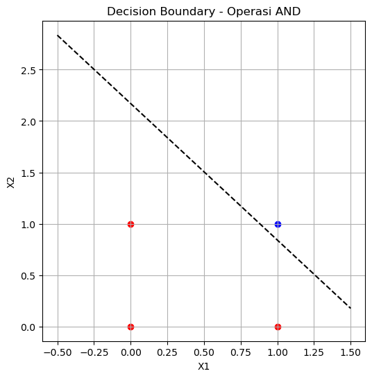
    


```python
import numpy as np
import matplotlib.pyplot as plt

X = np.array([[0,0],[0,1],[1,0],[1,1]])
y = np.array([0,1,1,1])  # operasi OR

w = np.random.rand(2)
b = np.random.rand(1)
lr = 0.1

for epoch in range(10):
    for i in range(len(X)):
        z = np.dot(X[i], w) + b
        y_pred = 1 if z > 0 else 0
        error = y[i] - y_pred
        w += lr * error * X[i]
        b += lr * error

plt.figure(figsize=(6,6))
for i in range(len(X)):
    plt.scatter(X[i][0], X[i][1], color='blue' if y[i]==1 else 'red')

x1 = np.linspace(-0.5, 1.5, 100)
x2 = -(w[0]*x1 + b)/w[1]
plt.plot(x1, x2, 'k--')

plt.title('Decision Boundary - Operasi OR')
plt.xlabel('X1')
plt.ylabel('X2')
plt.grid(True)
plt.show()

```


    
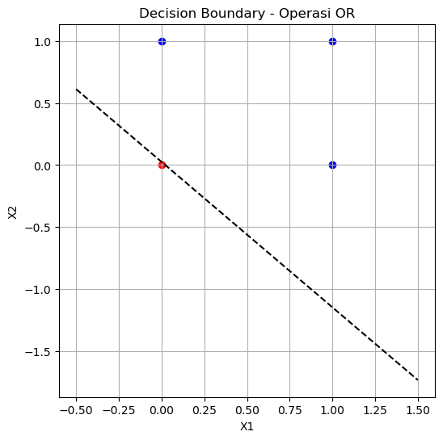
    


```python
import numpy as np
import matplotlib.pyplot as plt

X = np.array([[0],[1]])
y = np.array([1,0])  # operasi NOT

w = np.random.rand(1)
b = np.random.rand(1)
lr = 0.1

for epoch in range(10):
    for i in range(len(X)):
        z = np.dot(X[i], w) + b
        y_pred = 1 if z > 0 else 0
        error = y[i] - y_pred
        w += lr * error * X[i]
        b += lr * error

# Visualisasi 1D
plt.figure(figsize=(6,3))
plt.scatter(X, y, color='blue')
plt.plot(X, np.dot(X, w) + b, 'k--')
plt.title('Visualisasi Operasi NOT')
plt.xlabel('Input')
plt.ylabel('Output')
plt.grid(True)
plt.show()

```


    
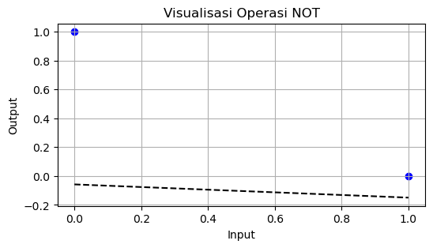
    


## Kegiatan 2 – JST Multilayer (Feedforward) 
Tujuan 
- Mengenal arsitektur multilayer neural network dan memahami konsep feedforward.
   
Langkah Kerja 
- Buat model JST dengan 2 input, 2 neuron pada hidden layer, dan 1 output neuron. 
- Gunakan fungsi aktivasi sigmoid. 
- Hitung hasil output berdasarkan bobot acak (belum dilakukan training).


```python
import numpy as np
import matplotlib.pyplot as plt

# --- Fungsi aktivasi ---
def sigmoid(x):
    return 1 / (1 + np.exp(-x))

# --- Data input (operasi XOR untuk contoh visualisasi) ---
X = np.array([[0,0],[0,1],[1,0],[1,1]])

# --- Bobot dan bias acak ---
w1 = np.random.rand(2,2)   # 2 input → 2 neuron hidden
b1 = np.random.rand(2)
w2 = np.random.rand(2)     # 2 neuron hidden → 1 output
b2 = np.random.rand(1)

# --- Proses feedforward ---
def feedforward(x):
    z1 = np.dot(x, w1) + b1
    a1 = sigmoid(z1)
    z2 = np.dot(a1, w2) + b2
    return sigmoid(z2)

# --- Cetak hasil untuk tiap kombinasi input ---
print("Hasil Feedforward JST Multilayer (bobot acak):")
for x in X:
    y_pred = feedforward(x)
    print(x, "->", y_pred)

# --- Visualisasi 2D decision surface ---
# Membuat grid untuk memetakan output JST
xx, yy = np.meshgrid(np.linspace(-0.2, 1.2, 200), np.linspace(-0.2, 1.2, 200))
grid = np.c_[xx.ravel(), yy.ravel()]
zz = np.array([feedforward(p) for p in grid])
zz = zz.reshape(xx.shape)

plt.figure(figsize=(7,6))
# Visualisasi hasil output JST dalam bentuk kontur warna
contour = plt.contourf(xx, yy, zz, levels=50, cmap='coolwarm', alpha=0.8)
plt.colorbar(contour, label='Output JST (aktivasi sigmoid)')

# Titik data asli
plt.scatter(X[:,0], X[:,1], color='black', edgecolor='white', s=100, label='Input data')

plt.title('Visualisasi 2D JST Multilayer (Feedforward tanpa training)')
plt.xlabel('X1')
plt.ylabel('X2')
plt.legend()
plt.grid(True)
plt.show()

```

    Hasil Feedforward JST Multilayer (bobot acak):
    [0 0] -> [0.86831203]
    [0 1] -> [0.88334123]
    [1 0] -> [0.89029617]
    [1 1] -> [0.90060925]
    


    
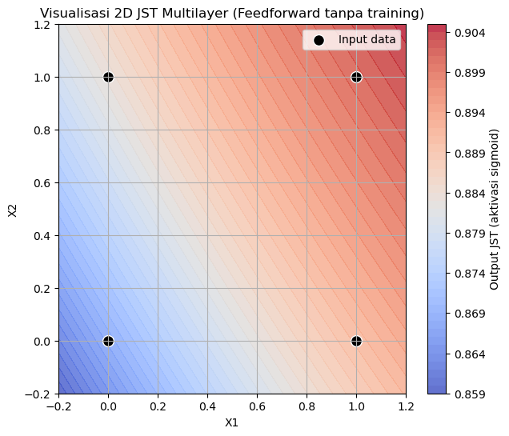
    


- Latar belakang berwarna (contour) menunjukkan nilai output JST pada setiap posisi kombinasi input X1–X2.
- Warna merah → output mendekati 1
- Warna biru → output mendekati 0
- Titik hitam adalah empat kombinasi input logika: (0,0), (0,1), (1,0), (1,1).

Karena bobot masih acak, pola pembagian area masih acak pula. Setelah JST dilatih dengan backpropagation, warna area akan membentuk pola yang memisahkan kelas dengan lebih jelas.

-----------

## Kegiatan 3 – JST Multilayer (Backpropagation Training)

Tujuan:
Memahami proses training jaringan saraf tiruan multilayer (MLP) menggunakan algoritma backpropagation.

Langkah Kerja:
- Gunakan arsitektur yang sama: 2 input → 2 neuron hidden → 1 output.
- Gunakan fungsi aktivasi sigmoid.
- Lakukan training untuk operasi logika XOR.
- Tampilkan hasil decision boundary setelah training


```python
import numpy as np
import matplotlib.pyplot as plt

# --- Fungsi aktivasi dan turunannya ---
def sigmoid(x):
    return 1 / (1 + np.exp(-x))

def sigmoid_derivative(x):
    return x * (1 - x)

# --- Data input dan target (XOR) ---
X = np.array([[0,0],[0,1],[1,0],[1,1]])
y = np.array([[0],[1],[1],[0]])

# --- Inisialisasi bobot dan bias ---
np.random.seed(42)
w1 = np.random.rand(2,2)
b1 = np.random.rand(1,2)
w2 = np.random.rand(2,1)
b2 = np.random.rand(1,1)

lr = 0.5     # learning rate
epochs = 10000

# --- Training menggunakan Backpropagation ---
for epoch in range(epochs):
    # Feedforward
    z1 = np.dot(X, w1) + b1
    a1 = sigmoid(z1)
    z2 = np.dot(a1, w2) + b2
    y_pred = sigmoid(z2)

    # Hitung error dan loss
    error = y - y_pred
    loss = np.mean(error**2)

    # Backpropagation
    d_z2 = error * sigmoid_derivative(y_pred)
    d_w2 = np.dot(a1.T, d_z2)
    d_b2 = np.sum(d_z2, axis=0, keepdims=True)

    d_a1 = np.dot(d_z2, w2.T)
    d_z1 = d_a1 * sigmoid_derivative(a1)
    d_w1 = np.dot(X.T, d_z1)
    d_b1 = np.sum(d_z1, axis=0, keepdims=True)

    # Update bobot
    w2 += lr * d_w2
    b2 += lr * d_b2
    w1 += lr * d_w1
    b1 += lr * d_b1

    # Menampilkan loss setiap 1000 epoch
    if epoch % 1000 == 0:
        print(f"Epoch {epoch}, Loss = {loss:.4f}")

# --- Hasil setelah training ---
print("\nHasil Output JST Setelah Training:")
for x in X:
    z1 = np.dot(x, w1) + b1
    a1 = sigmoid(z1)
    z2 = np.dot(a1, w2) + b2
    y_pred = sigmoid(z2)
    print(f"{x} -> {float(y_pred):.4f}")

# --- Visualisasi Decision Boundary Setelah Training ---
xx, yy = np.meshgrid(np.linspace(-0.2, 1.2, 200), np.linspace(-0.2, 1.2, 200))
grid = np.c_[xx.ravel(), yy.ravel()]

def predict(p):
    z1 = np.dot(p, w1) + b1
    a1 = sigmoid(z1)
    z2 = np.dot(a1, w2) + b2
    return sigmoid(z2)

zz = np.array([predict(p) for p in grid])
zz = zz.reshape(xx.shape)

plt.figure(figsize=(7,6))
contour = plt.contourf(xx, yy, zz, levels=50, cmap='coolwarm', alpha=0.8)
plt.colorbar(contour, label='Output JST (aktivasi sigmoid)')

# Titik data XOR
for i in range(len(X)):
    plt.scatter(X[i][0], X[i][1], color='yellow' if y[i]==1 else 'black', edgecolor='white', s=120)

plt.title('Visualisasi JST Multilayer Setelah Training (Operasi XOR)')
plt.xlabel('X1')
plt.ylabel('X2')
plt.grid(True)
plt.show()

```

    Epoch 0, Loss = 0.3247
    Epoch 1000, Loss = 0.0126
    Epoch 2000, Loss = 0.0025
    Epoch 3000, Loss = 0.0013
    Epoch 4000, Loss = 0.0009
    Epoch 5000, Loss = 0.0007
    Epoch 6000, Loss = 0.0005
    Epoch 7000, Loss = 0.0004
    Epoch 8000, Loss = 0.0004
    Epoch 9000, Loss = 0.0003
    
    Hasil Output JST Setelah Training:
    [0 0] -> 0.0189
    [0 1] -> 0.9837
    [1 0] -> 0.9837
    [1 1] -> 0.0169
    

  
    


    
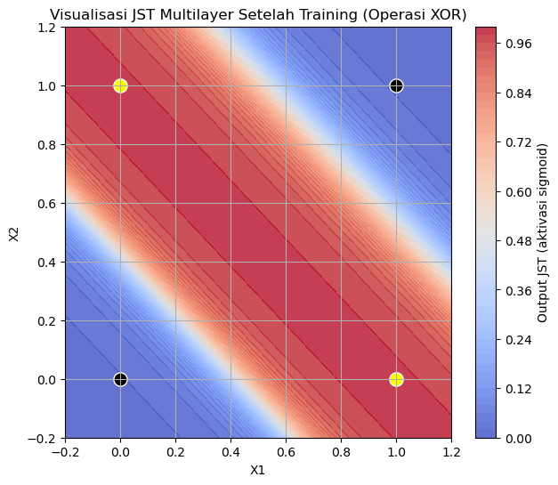
    


```python
# =====================================
# 🧩 JST Feedforward – DHT11 Simulation
# =====================================

import numpy as np
import pandas as pd
import matplotlib.pyplot as plt
from sklearn.model_selection import train_test_split
from sklearn.preprocessing import MinMaxScaler
import os

# --- Fungsi Aktivasi ---
def sigmoid(x):
    return 1 / (1 + np.exp(-x))

def sigmoid_deriv(x):
    return x * (1 - x)

# --- Opsi: Load data dari CSV atau buat data dummy ---
USE_CSV = False  # ubah ke True jika ingin load dari file csv

if USE_CSV and os.path.exists("data_dht11.csv"):
    data = pd.read_csv("data_dht11.csv")
    print("Data dimuat dari CSV.")
else:
    print("Menggunakan data dummy DHT11.")
    np.random.seed(0)
    n = 100
    humidity = np.random.uniform(40, 90, n)
    temperature = 0.5 * humidity + np.random.normal(0, 2, n)  # hubungan linear
    data = pd.DataFrame({
        "humidity": humidity,
        "temperature": temperature
    })

# --- Visualisasi Awal ---
plt.figure(figsize=(6,4))
plt.scatter(data["humidity"], data["temperature"], color="orange", edgecolor="k")
plt.title("Data DHT11 (Dummy)")
plt.xlabel("Kelembapan (%)")
plt.ylabel("Suhu (°C)")
plt.grid(True)
plt.show()

# --- Persiapan Data ---
X = data[["humidity"]].values
y = data[["temperature"]].values

# Normalisasi data
scaler_X = MinMaxScaler()
scaler_y = MinMaxScaler()
X_scaled = scaler_X.fit_transform(X)
y_scaled = scaler_y.fit_transform(y)

# Split data latih dan uji
X_train, X_test, y_train, y_test = train_test_split(X_scaled, y_scaled, test_size=0.2, random_state=42)

# --- Inisialisasi JST ---
np.random.seed(42)
w1 = np.random.rand(1, 4)   # 1 input → 4 neuron hidden
b1 = np.random.rand(4)
w2 = np.random.rand(4, 1)   # 4 neuron → 1 output
b2 = np.random.rand(1)
lr = 0.1
epochs = 3000

loss_list = []

# --- Training (Backpropagation) ---
for epoch in range(epochs):
    # Forward
    z1 = np.dot(X_train, w1) + b1
    a1 = sigmoid(z1)
    z2 = np.dot(a1, w2) + b2
    y_pred = sigmoid(z2)

    # Error (loss)
    error = y_train - y_pred
    loss = np.mean(error**2)
    loss_list.append(loss)

    # Backpropagation
    d_w2 = np.dot(a1.T, error * sigmoid_deriv(y_pred))
    d_b2 = np.sum(error * sigmoid_deriv(y_pred), axis=0)
    d_w1 = np.dot(X_train.T, (np.dot(error * sigmoid_deriv(y_pred), w2.T) * sigmoid_deriv(a1)))
    d_b1 = np.sum(np.dot(error * sigmoid_deriv(y_pred), w2.T) * sigmoid_deriv(a1), axis=0)

    # Update bobot
    w1 += lr * d_w1
    b1 += lr * d_b1
    w2 += lr * d_w2
    b2 += lr * d_b2

# --- Plot Loss ---
plt.figure(figsize=(6,3))
plt.plot(loss_list)
plt.title("Grafik Loss JST selama Training")
plt.xlabel("Epoch")
plt.ylabel("Loss (MSE)")
plt.grid(True)
plt.show()

# --- Evaluasi JST ---
z1 = np.dot(X_test, w1) + b1
a1 = sigmoid(z1)
z2 = np.dot(a1, w2) + b2
y_pred_test = sigmoid(z2)
y_pred_real = scaler_y.inverse_transform(y_pred_test)

# --- Visualisasi Hasil ---
plt.figure(figsize=(8,4))
plt.plot(scaler_y.inverse_transform(y_test), label="Aktual", marker="o")
plt.plot(y_pred_real, label="Prediksi JST", linestyle="--", marker="x")
plt.title("Prediksi Suhu Berdasarkan Kelembapan (JST Feedforward)")
plt.xlabel("Sampel Uji")
plt.ylabel("Suhu (°C)")
plt.legend()
plt.grid(True)
plt.show()

# --- Contoh Prediksi Baru ---
kelembapan_baru = np.array([[60]])  # contoh input
kelembapan_scaled = scaler_X.transform(kelembapan_baru)
z1 = np.dot(kelembapan_scaled, w1) + b1
a1 = sigmoid(z1)
z2 = np.dot(a1, w2) + b2
prediksi_scaled = sigmoid(z2)
prediksi_suhu = scaler_y.inverse_transform(prediksi_scaled)
print(f"Prediksi suhu untuk kelembapan {kelembapan_baru[0][0]:.1f}% = {prediksi_suhu[0][0]:.2f} °C")

```

    Menggunakan data dummy DHT11.
    


    
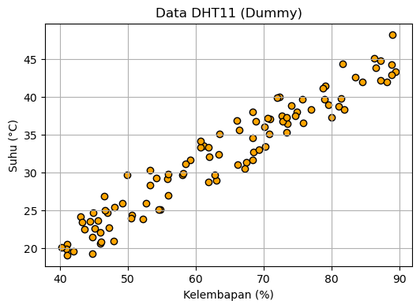
    


    
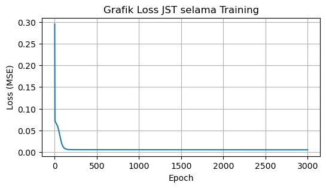
    


    
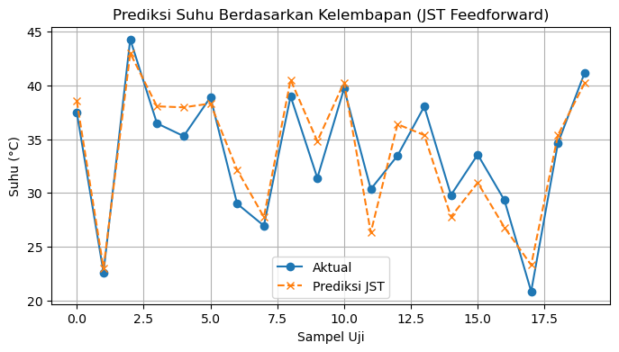
    


    Prediksi suhu untuk kelembapan 60.0% = 30.22 °C
    


```python
# =========================================================
# 🧠 JST Feedforward untuk Klasifikasi Keadaan Ruangan
# Input  : Suhu (°C) dan Kelembapan (%)
# Output : Kelas (0=Normal, 1=Panas, 2=Lembap)
# =========================================================

import numpy as np
import pandas as pd
import matplotlib.pyplot as plt
from sklearn.model_selection import train_test_split
from sklearn.preprocessing import MinMaxScaler, OneHotEncoder
import os

# --- Fungsi Aktivasi ---
def sigmoid(x):
    return 1 / (1 + np.exp(-x))

def sigmoid_deriv(x):
    return x * (1 - x)

# --- Opsi Load Data ---
USE_CSV = False  # ubah ke True jika ingin gunakan data logger DHT11 nyata

if USE_CSV and os.path.exists("data_dht11.csv"):
    data = pd.read_csv("data_dht11.csv")
    print("Data dimuat dari CSV.")
else:
    print("Menggunakan data dummy keadaan ruangan.")
    np.random.seed(0)
    n = 200
    suhu = np.random.uniform(25, 35, n)
    kelembapan = np.random.uniform(40, 90, n)
    
    kondisi = []
    for t, h in zip(suhu, kelembapan):
        if t > 30 and h < 60:
            kondisi.append("Panas")
        elif h > 75:
            kondisi.append("Lembap")
        else:
            kondisi.append("Normal")
    
    data = pd.DataFrame({
        "temperature": suhu,
        "humidity": kelembapan,
        "condition": kondisi
    })

# --- Tampilkan contoh data ---
print(data.head())

# --- Visualisasi data awal ---
plt.figure(figsize=(6,5))
for label, color in zip(["Normal", "Panas", "Lembap"], ["green", "red", "blue"]):
    subset = data[data["condition"] == label]
    plt.scatter(subset["temperature"], subset["humidity"], label=label, color=color, alpha=0.7)
plt.title("Distribusi Data Dummy DHT11")
plt.xlabel("Suhu (°C)")
plt.ylabel("Kelembapan (%)")
plt.legend()
plt.grid(True)
plt.show()

# --- Persiapan Data ---
X = data[["temperature", "humidity"]].values
y = data[["condition"]].values

# One-hot encoding untuk 3 kelas
encoder = OneHotEncoder(sparse_output=False)
y_encoded = encoder.fit_transform(y)

# Normalisasi input
scaler_X = MinMaxScaler()
X_scaled = scaler_X.fit_transform(X)

# Split data
X_train, X_test, y_train, y_test = train_test_split(X_scaled, y_encoded, test_size=0.2, random_state=42)

# --- Inisialisasi JST ---
np.random.seed(42)
input_dim = 2
hidden_dim = 6
output_dim = 3

w1 = np.random.rand(input_dim, hidden_dim)
b1 = np.random.rand(hidden_dim)
w2 = np.random.rand(hidden_dim, output_dim)
b2 = np.random.rand(output_dim)

lr = 0.1
epochs = 5000
loss_list = []

# --- Training (Backpropagation) ---
for epoch in range(epochs):
    # Forward
    z1 = np.dot(X_train, w1) + b1
    a1 = sigmoid(z1)
    z2 = np.dot(a1, w2) + b2
    y_pred = sigmoid(z2)

    # Error
    error = y_train - y_pred
    loss = np.mean(np.square(error))
    loss_list.append(loss)

    # Backpropagation
    d_w2 = np.dot(a1.T, error * sigmoid_deriv(y_pred))
    d_b2 = np.sum(error * sigmoid_deriv(y_pred), axis=0)
    d_w1 = np.dot(X_train.T, (np.dot(error * sigmoid_deriv(y_pred), w2.T) * sigmoid_deriv(a1)))
    d_b1 = np.sum(np.dot(error * sigmoid_deriv(y_pred), w2.T) * sigmoid_deriv(a1), axis=0)

    # Update bobot
    w1 += lr * d_w1
    b1 += lr * d_b1
    w2 += lr * d_w2
    b2 += lr * d_b2

# --- Plot Loss ---
plt.figure(figsize=(6,3))
plt.plot(loss_list)
plt.title("Grafik Loss JST Selama Training")
plt.xlabel("Epoch")
plt.ylabel("Loss (MSE)")
plt.grid(True)
plt.show()

# --- Evaluasi ---
z1 = np.dot(X_test, w1) + b1
a1 = sigmoid(z1)
z2 = np.dot(a1, w2) + b2
y_pred_test = sigmoid(z2)

# Prediksi kelas
y_pred_class = np.argmax(y_pred_test, axis=1)
y_true_class = np.argmax(y_test, axis=1)
acc = np.mean(y_pred_class == y_true_class) * 100

print(f"Akurasi Klasifikasi JST: {acc:.2f}%")

# --- Visualisasi Decision Boundary ---
xx, yy = np.meshgrid(np.linspace(24, 36, 200), np.linspace(35, 95, 200))
grid = np.c_[xx.ravel(), yy.ravel()]
grid_scaled = scaler_X.transform(grid)

z1 = np.dot(grid_scaled, w1) + b1
a1 = sigmoid(z1)
z2 = np.dot(a1, w2) + b2
Z = np.argmax(sigmoid(z2), axis=1).reshape(xx.shape)

plt.figure(figsize=(7,6))
plt.contourf(xx, yy, Z, levels=2, cmap="coolwarm", alpha=0.4)
for label, color in zip(["Normal", "Panas", "Lembap"], ["green", "red", "blue"]):
    subset = data[data["condition"] == label]
    plt.scatter(subset["temperature"], subset["humidity"], label=label, color=color, edgecolor="k")
plt.title("Decision Boundary JST (Klasifikasi Kondisi Ruangan)")
plt.xlabel("Suhu (°C)")
plt.ylabel("Kelembapan (%)")
plt.legend()
plt.grid(True)
plt.show()

# --- Uji prediksi kondisi baru ---
input_baru = np.array([[31, 55]])  # contoh suhu & kelembapan
scaled = scaler_X.transform(input_baru)
z1 = np.dot(scaled, w1) + b1
a1 = sigmoid(z1)
z2 = np.dot(a1, w2) + b2
pred = sigmoid(z2)
kelas_pred = encoder.categories_[0][np.argmax(pred)]
print(f"\nInput: Suhu={input_baru[0][0]}°C, Kelembapan={input_baru[0][1]}% → Prediksi Kondisi: {kelas_pred}")

# =========================================================
# 💾 Simpan Bobot JST untuk ESP32
# =========================================================

def save_weights_to_header(filename, w1, b1, w2, b2):
    with open(filename, "w") as f:
        f.write("// JST Weights Exported from Python\n\n")
        f.write(f"#define INPUT_DIM {w1.shape[0]}\n")
        f.write(f"#define HIDDEN_DIM {w1.shape[1]}\n")
        f.write(f"#define OUTPUT_DIM {w2.shape[1]}\n\n")

        # Bobot layer 1
        f.write(f"float w1[INPUT_DIM][HIDDEN_DIM] = {{\n")
        for i in range(w1.shape[0]):
            f.write("    {" + ", ".join(f"{v:.6f}" for v in w1[i]) + "},\n")
        f.write("};\n\n")

        # Bias layer 1
        f.write(f"float b1[HIDDEN_DIM] = {{" + ", ".join(f"{v:.6f}" for v in b1) + "};\n\n")

        # Bobot layer 2
        f.write(f"float w2[HIDDEN_DIM][OUTPUT_DIM] = {{\n")
        for i in range(w2.shape[0]):
            f.write("    {" + ", ".join(f"{v:.6f}" for v in w2[i]) + "},\n")
        f.write("};\n\n")

        # Bias layer 2
        f.write(f"float b2[OUTPUT_DIM] = {{" + ", ".join(f"{v:.6f}" for v in b2) + "};\n")

    print(f"\n✅ Bobot berhasil disimpan di: {filename}")

save_weights_to_header("jst_weights.h", w1, b1, w2, b2)


```

    Menggunakan data dummy keadaan ruangan.
       temperature   humidity condition
    0    30.488135  55.589794     Panas
    1    32.151894  74.817174    Normal
    2    31.027634  58.887592     Panas
    3    30.448832  48.980184     Panas
    4    29.236548  41.233936    Normal
    


    
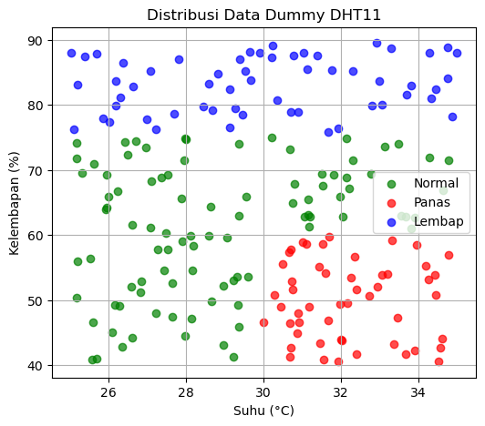
    


    
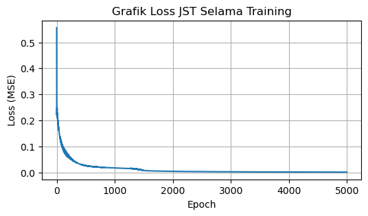
    


    Akurasi Klasifikasi JST: 100.00%
    


    
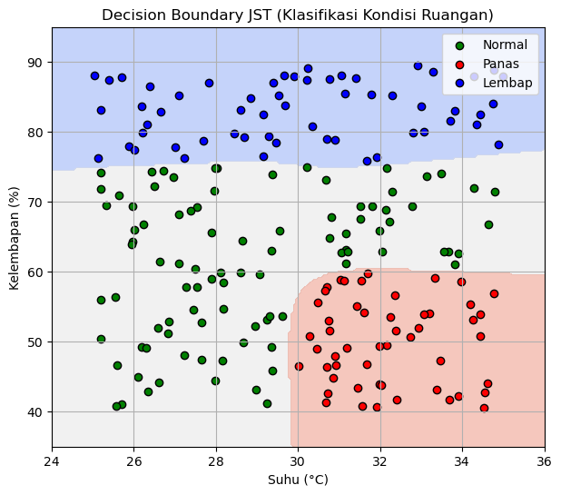
    


    
    Input: Suhu=31°C, Kelembapan=55% → Prediksi Kondisi: Panas
    
    ✅ Bobot berhasil disimpan di: jst_weights.h
    

Input: Suhu dan kelembapan

Output: Kelas (Normal, Panas, Lembap)
JST:
- Input layer: 2 neuron
- Hidden layer: 6 neuron
- Output layer: 3 neuron (karena 3 kelas)
  
Data Dummy: Dibuat acak dengan logika sederhana untuk simulasi realistis

Evaluasi: Menampilkan akurasi dan decision boundary hasil JST

---

### Urutan eksekusi ESP32

- Bobot hasil training Python disimpan dalam file `jst_weights.h` .
- File tersebut di-copy ke folder proyek Arduino (bersama .ino file).
- ESP32 menjalankan inferensi JST menggunakan input suhu & kelembapan.
- Output JST menentukan LED mana yang menyala:
  - Merah (Panas)
  - Hijau (Normal)
  - Biru (Lembap)

``` cpp

#include "jst_weights.h"
#include <math.h>

#define LED_MERAH 12
#define LED_HIJAU 13
#define LED_BIRU 14

float sigmoid(float x) {
  return 1.0 / (1.0 + exp(-x));
}

void setup() {
  Serial.begin(115200);
  pinMode(LED_MERAH, OUTPUT);
  pinMode(LED_HIJAU, OUTPUT);
  pinMode(LED_BIRU, OUTPUT);
}

void loop() {
  // --- Contoh input suhu dan kelembapan (bisa diganti dari sensor DHT11)
  float suhu = 31.0;
  float kelembapan = 55.0;

  // Normalisasi sesuai data training di Python (25–35°C, 40–90%)
  float suhu_norm = (suhu - 25) / (35 - 25);
  float kelembapan_norm = (kelembapan - 40) / (90 - 40);
  float input[2] = {suhu_norm, kelembapan_norm};

  // --- Feedforward JST ---
  float hidden[HIDDEN_DIM];
  for (int i = 0; i < HIDDEN_DIM; i++) {
    float sum = b1[i];
    for (int j = 0; j < INPUT_DIM; j++) {
      sum += input[j] * w1[j][i];
    }
    hidden[i] = sigmoid(sum);
  }

  float output[OUTPUT_DIM];
  for (int i = 0; i < OUTPUT_DIM; i++) {
    float sum = b2[i];
    for (int j = 0; j < HIDDEN_DIM; j++) {
      sum += hidden[j] * w2[j][i];
    }
    output[i] = sigmoid(sum);
  }

  // --- Tentukan kelas prediksi ---
  int kelas = 0;
  float maxVal = output[0];
  for (int i = 1; i < OUTPUT_DIM; i++) {
    if (output[i] > maxVal) {
      maxVal = output[i];
      kelas = i;
    }
  }

  // --- Reset semua LED ---
  digitalWrite(LED_MERAH, LOW);
  digitalWrite(LED_HIJAU, LOW);
  digitalWrite(LED_BIRU, LOW);

  // --- Nyalakan LED sesuai kelas ---
  if (kelas == 1) {
    digitalWrite(LED_MERAH, HIGH);
    Serial.println("🔥 Kondisi: PANAS");
  } else if (kelas == 0) {
    digitalWrite(LED_HIJAU, HIGH);
    Serial.println("✅ Kondisi: NORMAL");
  } else if (kelas == 2) {
    digitalWrite(LED_BIRU, HIGH);
    Serial.println("💧 Kondisi: LEMBAP");
  }

  delay(3000);
}

```


## Lisensi
Proyek ini bersifat open-source dan bebas digunakan untuk pembelajaran maupun pengembangan lebih lanjut.
